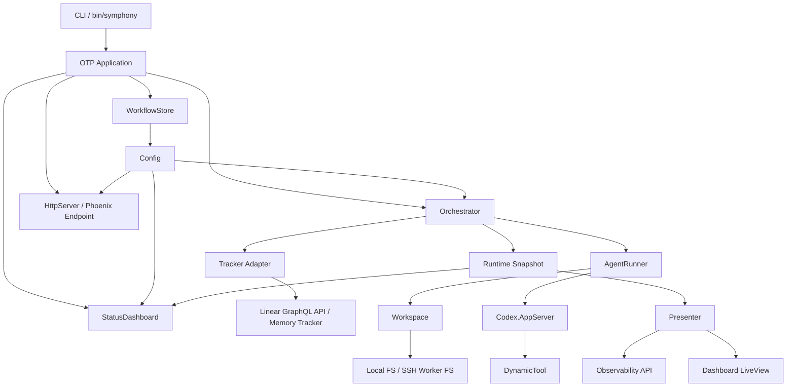
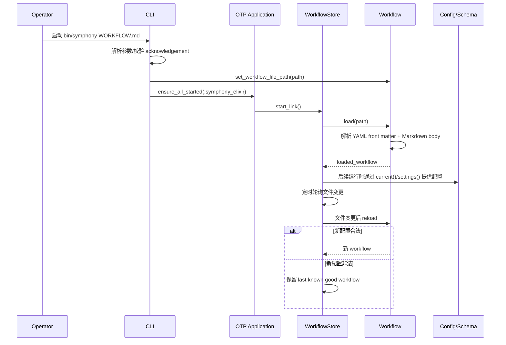
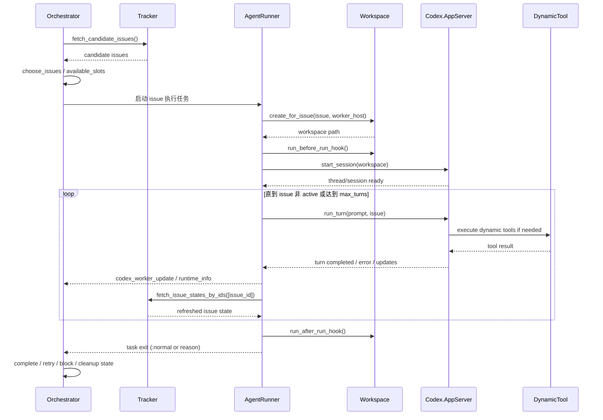
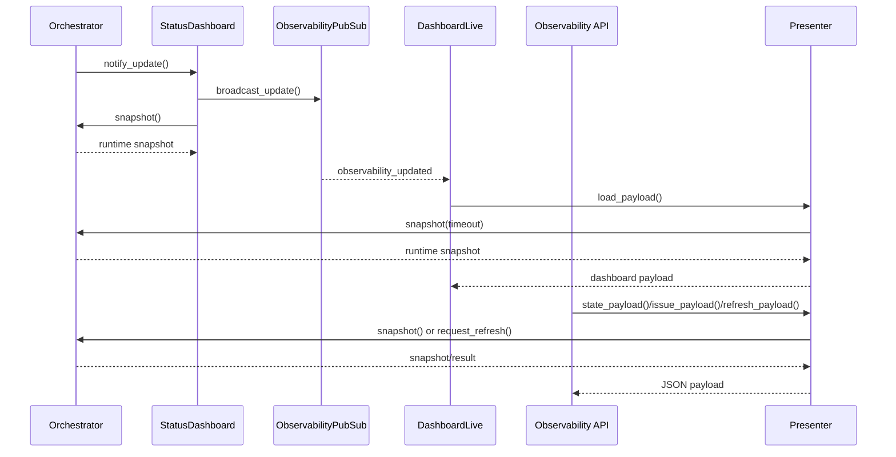

# Symphony Elixir 架构说明

本文档面向当前 `elixir/` 目录下的实现，说明 Symphony Elixir 的运行架构、核心模块职责、关键调用链与时序关系，帮助维护者快速理解系统如何从 `WORKFLOW.md` 启动一个面向 Linear issue 的 Codex 编排服务。

## 1. 系统概览

Symphony Elixir 是一个基于 OTP 的长期运行编排服务，负责轮询任务源、为每个 issue 创建独立工作区、启动 Codex App Server 会话执行任务，并通过终端状态面板与 Phoenix 观测面板暴露运行状态。

从运行形态上看，系统分成三条主线：

1. **配置与启动链路**：CLI 读取 `WORKFLOW.md`，应用启动后由 `WorkflowStore` 持续缓存并热重载工作流配置。
2. **任务编排链路**：`Orchestrator` 周期性轮询 Tracker，按并发限制挑选 issue，交给 `AgentRunner` 在隔离工作区中驱动 Codex 执行。
3. **观测链路**：`StatusDashboard` 负责终端实时状态渲染，Phoenix `LiveView + JSON API` 负责浏览器侧观测。

系统的外部依赖主要有：

- **Linear GraphQL API**：默认任务源
- **Codex App Server**：执行 agent turn 的底层运行时
- **本地或 SSH worker 文件系统**：承载 issue 级别工作区
- **Phoenix/Bandit**：提供 Web 观测入口

## 2. 启动架构

### 2.1 启动入口

启动入口是 `lib/symphony_elixir/cli.ex` 中的 `SymphonyElixir.CLI.main/1`，它负责：

- 解析命令行参数
- 校验 guardrails acknowledgement 开关
- 设置可选的日志根目录与 Web 端口覆盖
- 指定当前使用的 `WORKFLOW.md`
- 通过 `Application.ensure_all_started(:symphony_elixir)` 拉起整个 OTP 应用

在应用层，`lib/symphony_elixir.ex` 中的 `SymphonyElixir.Application.start/2` 负责组装监督树：

- `Phoenix.PubSub`
- `Task.Supervisor`
- `SymphonyElixir.WorkflowStore`
- `SymphonyElixir.Orchestrator`
- `SymphonyElixir.HttpServer`
- `SymphonyElixir.StatusDashboard`

这意味着系统是一个标准的一对多监督模型：配置缓存、编排循环、Web 服务和状态面板都在同一应用生命周期中被托管。

### 2.2 配置加载与热重载

配置入口有两层：

- `SymphonyElixir.Workflow`：负责读取并解析 `WORKFLOW.md` 的 YAML front matter + Markdown body
- `SymphonyElixir.Config` / `SymphonyElixir.Config.Schema`：把解析结果转换成强约束的运行时配置结构

其中：

- front matter 负责 tracker、workspace、worker、agent、codex、hooks、observability、server 等配置
- Markdown body 作为 agent prompt 模板
- 空 body 时使用 `Config` 内置默认 prompt 模板

`WorkflowStore` 是配置链路中的关键角色：

- 启动时加载当前 workflow
- 周期性检查文件时间戳、大小和内容哈希
- 文件变更时重新加载
- 如果新配置非法，则保留 last known good workflow 并记录错误日志

这种设计保证了配置可热更新，同时避免错误配置直接打挂运行中的编排服务。

## 3. 高层架构设计

从职责分层看：

- **入口层**：CLI、Application
- **配置层**：Workflow、WorkflowStore、Config、Config.Schema
- **编排层**：Orchestrator、AgentRunner
- **基础设施层**：Workspace、Codex.AppServer、SSH、PathSafety、Tracker/Linear
- **观测层**：StatusDashboard、Presenter、ObservabilityApiController、DashboardLive、Router

## 4. 核心模块设计

### 4.1 CLI 与 Application

#### `SymphonyElixir.CLI`

职责：

- 解析启动参数
- 在真正启动应用前完成路径和端口注入
- 阻止未确认 guardrails 风险的直接运行
- 启动后阻塞等待 Supervisor 退出

特点：

- CLI 只负责“进程外启动决策”，不直接承担业务逻辑
- 把 runtime 注入压缩成 `Application.put_env/3`，避免污染业务模块

#### `SymphonyElixir.Application`

职责：

- 构建监督树
- 启动基础依赖（PubSub、TaskSupervisor、WorkflowStore、Orchestrator、HttpServer、StatusDashboard）
- 应用退出时渲染 offline terminal status

特点：

- 编排核心与观测核心被同时拉起
- Web 层是可选的，由 `HttpServer` 根据端口配置决定是否启用

### 4.2 Workflow / Config 配置域

#### `SymphonyElixir.Workflow`

职责：

- 定位当前 workflow 文件
- 解析 front matter 和 prompt body
- 对外提供 `current/0`、`load/0` 等统一读取接口

特点：

- prompt 与 config 同源，避免多处配置分裂
- 当 `WorkflowStore` 在线时，优先读取缓存版本

#### `SymphonyElixir.WorkflowStore`

职责：

- 缓存最近一次成功加载的 workflow
- 轮询文件变化并执行热重载
- 在 reload 失败时保留旧配置

特点：

- 是整个系统“热配置安全阀”
- 失败场景不会把运行中的 orchestrator 一起拖垮

#### `SymphonyElixir.Config`

职责：

- 从 Workflow 中读取当前 config
- 提供 `settings!/0`、`server_port/0`、`workflow_prompt/0`、`codex_runtime_settings/2` 等高层 API
- 执行 tracker/codex/workflow 级别语义校验

#### `SymphonyElixir.Config.Schema`

职责：

- 用 Ecto embedded schema 描述完整配置结构
- 注入默认值
- 校验数值和字段结构
- 推导默认 sandbox policy

特点：

- 当前系统把 `WORKFLOW.md` 视为部署契约，而不是随意字符串配置
- 所有运行模块都通过 `Config` 取值，形成统一配置入口

### 4.3 编排核心

#### `SymphonyElixir.Orchestrator`

这是系统的核心调度器，职责包括：

- 周期性 tick 与 poll cycle 调度
- 读取当前 runtime config
- 从 Tracker 拉取候选 issue
- 维护运行态：
  - `running`
  - `completed`
  - `claimed`
  - `blocked`
  - `retry_attempts`
  - `codex_totals`
  - `codex_rate_limits`
- 在 agent task 正常结束、异常退出、输入阻塞、需要重试等情况下更新状态
- 提供 snapshot 给终端和 Web 观测层使用

状态模型可以概括为：

- **running**：当前有 agent 正在执行
- **retrying**：等待 backoff 后重试
- **blocked**：因为 operator input / approval 等不可交互事件被阻塞
- **completed/claimed**：用于控制调度和去重

它是一个典型的“单进程调度脑 + 外围任务执行者”模型：

- 调度决策集中在 GenServer 内部
- 实际 issue 执行交给外部任务/worker
- 所有运行结果通过消息回流更新 orchestrator 状态

#### `SymphonyElixir.AgentRunner`

职责：

- 执行单个 issue 的一次 agent 生命周期
- 选择 worker host（本地或 SSH）
- 创建/复用 issue workspace
- 执行 before/after hook
- 启动 Codex session
- 在 `max_turns` 范围内循环运行 turn
- 将 codex 消息与 worker runtime 信息发回 orchestrator

特点：

- `AgentRunner` 不管理全局并发，它只关心“单个 issue 怎么跑完”
- 多 turn continuation 由它负责，跨 attempt 重试由 `Orchestrator` 负责
- 这样把“本次执行”和“全局重试策略”分成了两个责任域

### 4.4 任务源与 Tracker 适配层

#### `SymphonyElixir.Tracker`

职责：

- 抽象 issue tracker 的读取/写入边界
- 定义统一行为：获取候选 issue、按状态查 issue、更新状态、创建 comment

#### `SymphonyElixir.Linear.Adapter`

职责：

- 实现 Tracker behaviour
- 把通用 tracker 操作映射到 Linear GraphQL 请求

特点：

- 当前默认 `linear`，也支持 `memory` tracker
- 编排层只依赖 `Tracker`，不依赖具体 Linear 协议
- 这是系统主要的外部系统隔离点之一

### 4.5 Workspace 与执行环境

#### `SymphonyElixir.Workspace`

职责：

- 为每个 issue 创建隔离工作区
- 校验工作区路径必须处于配置的 workspace root 下
- 支持本地文件系统与远端 SSH worker 文件系统
- 执行 `after_create`、`before_run`、`after_run`、`before_remove` hook
- 清理 issue 级工作区

这是系统安全边界中很关键的一层：

- 通过 `PathSafety.canonicalize()` 和 root 范围校验防止 workspace escape
- 防止 Codex 在 orchestrator 源仓库中直接运行
- 将 issue 生命周期与文件系统目录一一绑定，简化隔离与清理

### 4.6 Codex 运行时适配

#### `SymphonyElixir.Codex.AppServer`

职责：

- 启动 `codex app-server`
- 与 app-server 建立基于 stdio 的 JSON-RPC 2.0 通信
- 完成 initialize → thread/start → turn/start 生命周期
- 处理 turn 完成、错误、工具调用、消息流和 session 停止
- 注入动态工具规格（`DynamicTool.tool_specs/0`）

特点：

- 本地模式通过 `Port.open` 启动 bash/codex
- 远端模式通过 `SSH.start_port` 启动
- session 与 turn 的 sandbox/approval policy 全由 `Config` 统一提供
- 是系统与 Codex runtime 的协议适配层

#### `SymphonyElixir.Codex.DynamicTool`

职责：

- 暴露运行时动态工具给 Codex
- 当前 README 明确提到 `linear_graphql` 等工具由 Symphony 在 app-server session 中提供

这让 agent 执行不仅是“收到 prompt 并生成文本”，还可以通过受控工具与外部系统交互。

### 4.7 观测与展示层

#### `SymphonyElixir.StatusDashboard`

职责：

- 周期性从 orchestrator 获取 snapshot
- 在终端渲染实时状态视图
- 广播观测更新给 PubSub
- 计算吞吐、token 使用、运行中和阻塞任务概览

特点：

- 是 terminal-first 的实时状态面板
- 会对渲染频率做节流，避免高频输出闪烁
- 应用停止时会输出 offline 状态

#### `SymphonyElixir.HttpServer`

职责：

- 在配置开启时启动 Phoenix Endpoint
- 注入 endpoint 配置、绑定 IP/端口、生成 secret key

这是 Web 观测链路的装配点，不承担业务投影逻辑。

#### `SymphonyElixirWeb.Presenter`

职责：

- 把 orchestrator snapshot 投影成适合 API 与 UI 使用的 payload
- 统一 running/retrying/blocked 的展示结构
- 生成 issue 级详情 payload

它充当“运行态 → 表示层 DTO”的转换器，让 Web 层不用直接依赖 orchestrator 内部结构。

#### `SymphonyElixirWeb.ObservabilityApiController`

职责：

- 暴露 `/api/v1/state`
- 暴露 `/api/v1/:issue_identifier`
- 暴露 `/api/v1/refresh`

特点：

- API 是只读观测接口 + 一个 refresh 触发入口
- 错误响应被统一结构化为 `{error: {code, message}}`

#### `SymphonyElixirWeb.DashboardLive`

职责：

- 渲染浏览器端实时 dashboard
- 订阅 `ObservabilityPubSub`
- 周期性更新 “now” 以刷新运行时长等动态字段

特点：

- LiveView 只消费 Presenter 产物
- 页面结构聚焦 metrics、rate limits、running sessions、blocked sessions

## 5. 关键运行数据流

### 5.1 配置数据流

### 5.2 Issue 调度与执行数据流

### 5.3 Web 观测链路

## 6. 模块边界与设计取舍

### 6.1 为什么 `Orchestrator` 不直接执行 Codex

当前设计把“调度”与“执行”分离：

- `Orchestrator` 负责全局状态、并发、重试、调度窗口
- `AgentRunner` 负责单 issue 执行生命周期
- `Codex.AppServer` 负责协议适配

好处是：

- 调度状态机更稳定，避免被 IO/进程细节污染
- 单次执行失败不会破坏调度循环抽象
- 更容易支持本地与 SSH worker 两种执行形态

### 6.2 为什么引入 `WorkflowStore`

如果所有模块每次都直接读取 `WORKFLOW.md`：

- 文件更新时容易出现不一致读
- 非法配置会立刻影响运行逻辑
- 高频读取增加解析成本

`WorkflowStore` 提供了统一缓存与 last-known-good 策略，等价于为系统加了一个轻量配置控制平面。

### 6.3 为什么观测层走 `Presenter`

`Presenter` 让 UI/API 不需要理解 orchestrator 的内部状态结构，例如：

- running/retrying/blocked 的原始字段差异
- 时间字段 ISO8601 化
- token 使用量和 message 文本摘要

这降低了控制层与展示层耦合，也方便以后扩展 API 字段而不直接改动核心状态结构。

### 6.4 工作区安全边界

系统明确把工作区隔离视为一等公民约束：

- 工作区目录必须位于 `workspace.root` 下
- 本地模式下会校验 canonical path，防止 symlink escape
- hook 和 codex cwd 都绑定到 issue workspace
- 不允许直接在 orchestrator 源仓库中运行 agent turn

这条边界是整个系统避免误改主仓库、实现并行 issue 执行的关键前提。

## 7. 当前仓库中的主要代码分区

### 7.1 `lib/symphony_elixir/`

这一层是编排核心与基础设施实现：

- `cli.ex`：启动入口
- `workflow.ex` / `workflow_store.ex`：workflow 读取与热重载
- `config.ex` / `config/schema.ex`：配置解析与校验
- `orchestrator.ex`：调度状态机
- `agent_runner.ex`：单 issue 执行器
- `workspace.ex`：issue 工作区管理
- `tracker.ex` / `linear/*`：任务源适配
- `codex/*`：Codex app-server 适配
- `status_dashboard.ex`：终端观测面板
- `http_server.ex`：Web 服务装配

### 7.2 `lib/symphony_elixir_web/`

这一层是浏览器观测面板：

- `router.ex`：路由装配
- `live/dashboard_live.ex`：LiveView dashboard
- `controllers/observability_api_controller.ex`：JSON API
- `presenter.ex`：展示数据投影
- `components/layouts.ex` / `static_assets.ex` 等：Web 外围支持

### 7.3 `test/`

测试覆盖按职责大致分为：

- 核心编排与配置测试：`core_test.exs`、`workspace_and_config_test.exs`
- Codex 适配测试：`app_server_test.exs`、`dynamic_tool_test.exs`
- CLI/SSH/日志测试：`cli_test.exs`、`ssh_test.exs`、`log_file_test.exs`
- 观测/UI 测试：`orchestrator_status_test.exs`、`status_dashboard_snapshot_test.exs`、`observability_pubsub_test.exs`
- 真实 E2E：`live_e2e_test.exs`

## 8. 典型运行场景

### 场景 A：本地启动编排器

1. 执行 `./bin/symphony ./WORKFLOW.md`
2. CLI 校验 acknowledgement 和参数
3. 应用启动监督树
4. `WorkflowStore` 装载 workflow
5. `Orchestrator` 开始按 `polling.interval_ms` 轮询
6. `StatusDashboard` 刷新终端状态
7. 如果配置了 `server.port` 或 `--port`，则同时提供 Web dashboard

### 场景 B：处理一个 Linear issue

1. `Tracker.fetch_candidate_issues/0` 返回候选 issue
2. `Orchestrator` 根据并发限制选择 issue
3. `AgentRunner` 为该 issue 创建工作区
4. 执行 `after_create` / `before_run` hook
5. 启动 Codex App Server session
6. 运行一个或多个 turn，期间可调用动态工具
7. issue 仍处于 active state 时继续 turn 或由 orchestrator 后续重试
8. issue 进入 terminal state 时 orchestrator 清理工作区并回收状态

### 场景 C：浏览器查看运行状态

1. 访问 `/`
2. `DashboardLive` 通过 `Presenter.state_payload/2` 获取快照
3. orchestrator 状态变化时，`StatusDashboard.notify_update/1` 经 PubSub 推送更新
4. LiveView 自动刷新 metrics、running sessions、blocked sessions 等内容

## 9. 扩展建议

基于当前实现，后续扩展最自然的方向包括：

1. **新增 Tracker 类型**：只要实现 `SymphonyElixir.Tracker` behaviour，即可引入新的任务系统。
2. **增强 worker 调度**：目前 `AgentRunner` 选择 host 的策略较简单，可以扩展成负载感知调度。
3. **增强日志与追踪**：当前已有 `docs/logging.md` 规范，可以继续接入结构化 tracing。
4. **增强观测投影**：在 `Presenter` 层扩展更多 issue/session 维度而不破坏 orchestrator。
5. **更丰富的动态工具协议**：在 `Codex.DynamicTool` 边界内增加更多安全受控能力。

## 10. 总结

Symphony Elixir 的核心设计思想可以概括为三点：

1. **以 OTP 为中心的稳定编排循环**：`Orchestrator` 管全局，`AgentRunner` 管单次执行。
2. **以 `WORKFLOW.md` 为中心的部署契约**：配置、prompt、sandbox、hooks 都从同一来源派生。
3. **以 issue workspace 为中心的执行隔离**：保证并行执行与主仓库安全边界。

如果把它看成一个系统分层模型，那么它本质上是：

- 上层：CLI / Web 观测入口
- 中层：配置缓存 + 调度状态机
- 下层：工作区、Codex runtime、Tracker 适配、SSH/文件系统

这套结构对当前仓库规模是清晰且实用的，也为后续增加更多 tracker、worker 和观测能力保留了较好的演进空间。
