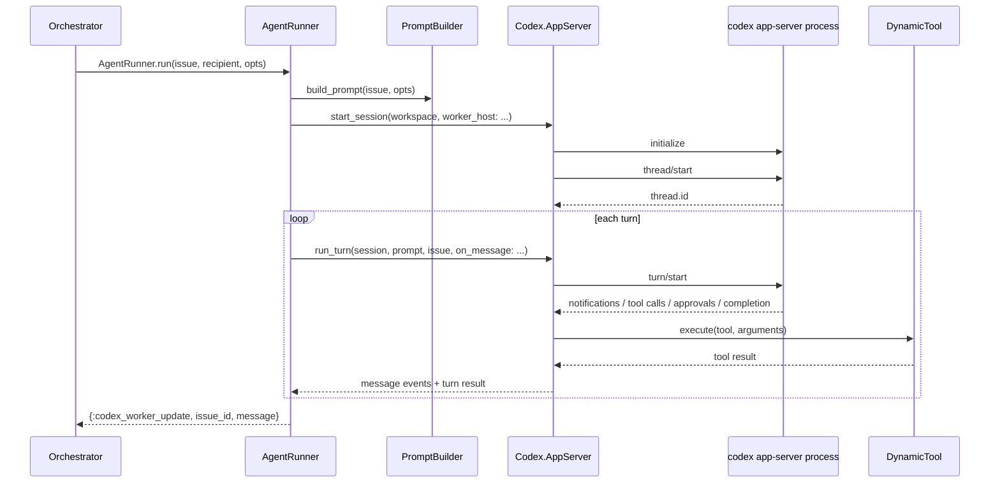

# Codex 集成深度技术说明

本文档专门说明 `elixir/` 目录里 **Symphony 是如何调用 Codex app-server** 的。重点不是高层架构，而是源码级调用链、JSON-RPC 消息、配置注入、dynamic tool、approval/input-required 处理，以及这些事件如何回流到 `Orchestrator`。

如果你要回答下面这些问题，这份文档就是对应答案：

- Symphony 到底从哪里开始调 Codex？
- 它给 Codex 发了哪些 JSON-RPC 消息？
- thread 和 turn 是怎么区分的？
- approval policy / sandbox policy 是怎么传进去的？
- `linear_graphql` 动态工具是怎么注册和执行的？
- 为什么会出现 `approval_required` / `turn_input_required`？
- Codex 的流式消息最后怎么变成 orchestrator 的 runtime 状态？

主要文件：

- `lib/symphony_elixir/agent_runner.ex`
- `lib/symphony_elixir/codex/app_server.ex`
- `lib/symphony_elixir/codex/dynamic_tool.ex`
- `lib/symphony_elixir/config.ex`
- `lib/symphony_elixir/config/schema.ex`
- `lib/symphony_elixir/prompt_builder.ex`

---

## 1. 总体调用链

先看最短主链：



一句话概括：

> `AgentRunner` 负责“什么时候跑 Codex”，`Codex.AppServer` 负责“怎么用 JSON-RPC 跟 Codex 说话”，`DynamicTool` 负责“Codex 请求的工具在 Symphony 侧怎么真正执行”。

---

## 2. 调用入口：从哪里真正开始调 Codex

真正调 Codex 的第一入口不在 `Orchestrator`，而在 `AgentRunner`。

### 2.1 `AgentRunner.run/3`

文件：`lib/symphony_elixir/agent_runner.ex:11`

核心逻辑：

```elixir
@spec run(map(), pid() | nil, keyword()) :: :ok | no_return()
def run(issue, codex_update_recipient \ nil, opts \ []) do
  worker_host = selected_worker_host(
    Keyword.get(opts, :worker_host),
    Config.settings!().worker.ssh_hosts
  )

  case run_on_worker_host(issue, codex_update_recipient, opts, worker_host) do
    :ok ->
      :ok

    {:error, reason} ->
      raise RuntimeError,
        "Agent run failed for #{issue_context(issue)}: #{inspect(reason)}"
  end
end
```

这里有两个关键点：

1. `AgentRunner` 自己不做调度，它只执行“这一条 issue 的一次 worker 生命周期”。
2. 如果 Codex 链路失败，最终会 `raise`，由 `Orchestrator` 在 `:DOWN` 分支里接住并做 retry/block 判定。

### 2.2 `run_on_worker_host/4`

文件：`lib/symphony_elixir/agent_runner.ex:28`

```elixir
defp run_on_worker_host(issue, codex_update_recipient, opts, worker_host) do
  case Workspace.create_for_issue(issue, worker_host) do
    {:ok, workspace} ->
      send_worker_runtime_info(codex_update_recipient, issue, worker_host, workspace)

      try do
        with :ok <- Workspace.run_before_run_hook(workspace, issue, worker_host) do
          run_codex_turns(workspace, issue, codex_update_recipient, opts, worker_host)
        end
      after
        Workspace.run_after_run_hook(workspace, issue, worker_host)
      end

    {:error, reason} ->
      {:error, reason}
  end
end
```

Codex 之前的准备动作顺序固定是：

1. 建 workspace
2. 把 `workspace_path` / `worker_host` 通知 orchestrator
3. 跑 `before_run` hook
4. 才真正进入 Codex
5. 无论成功失败，最后都跑 `after_run` hook

### 关键细节 1：Codex 调用总是在 issue workspace 中发生，不允许直接在 orchestrator 源目录里跑

这是通过 `Workspace` 和 `Codex.AppServer.validate_workspace_cwd/2` 双重约束完成的：

- `Workspace` 保证目录位于 `workspace.root` 下
- `AppServer` 在启动 port 之前再次校验 cwd

见：

- `lib/symphony_elixir/workspace.ex:358`
- `lib/symphony_elixir/codex/app_server.ex:146`

---

## 3. 进入 Codex 前，prompt 是怎么生成的

Codex 并不是直接吃 `WORKFLOW.md` 文件，而是先由 `PromptBuilder` 把模板渲染成最终字符串。

文件：`lib/symphony_elixir/prompt_builder.ex:9`

```elixir
@spec build_prompt(SymphonyElixir.Linear.Issue.t(), keyword()) :: String.t()
def build_prompt(issue, opts \ []) do
  template =
    Workflow.current()
    |> prompt_template!()
    |> parse_template!()

  template
  |> Solid.render!(
    %{
      "attempt" => Keyword.get(opts, :attempt),
      "issue" => issue |> Map.from_struct() |> to_solid_map()
    },
    @render_opts
  )
  |> IO.iodata_to_binary()
end
```

### 3.1 输入变量

模板可用变量主要有：

- `issue.identifier`
- `issue.title`
- `issue.description`
- `issue.state`
- `issue.labels`
- `attempt`

### 3.2 为什么要 `to_solid_map/1`

因为 `issue` 是 Elixir struct，不能直接喂给 Liquid/Solid 模板引擎，所以先递归转成 string/map/list/date 可渲染值。

例如：

```elixir
defp to_solid_map(map) when is_map(map) do
  Map.new(map, fn {key, value} -> {to_string(key), to_solid_value(value)} end)
end
```

### 3.3 continuation turn 的 prompt 不是重新渲染整份模板

第一轮 turn 用 workflow prompt；第二轮及以后 turn，`AgentRunner` 发送 continuation guidance：

文件：`lib/symphony_elixir/agent_runner.ex:132`

```elixir
defp build_turn_prompt(issue, opts, 1, _max_turns), do: PromptBuilder.build_prompt(issue, opts)

defp build_turn_prompt(_issue, _opts, turn_number, max_turns) do
  """
  Continuation guidance:

  - The previous Codex turn completed normally, but the Linear issue is still in an active state.
  - This is continuation turn ##{turn_number} of #{max_turns} for the current agent run.
  - Resume from the current workspace and workpad state instead of restarting from scratch.
  """
end
```

### 关键细节 2：多轮 turn 的上下文连续性依赖 Codex thread，而不是每轮重复喂完整 prompt

这意味着：

- 上下文保存由 Codex thread 负责
- Symphony 在 continuation 时更像是“给一条提醒”，而不是重新构造整轮上下文

---

## 4. Codex 相关配置是怎么注入的

### 4.1 配置源头

Codex 配置定义在 `Config.Schema.Codex`：

文件：`lib/symphony_elixir/config/schema.ex:153`

```elixir
embedded_schema do
  field(:command, :string, default: "codex app-server")

  field(:approval_policy, StringOrMap,
    default: %{
      "reject" => %{
        "sandbox_approval" => true,
        "rules" => true,
        "mcp_elicitations" => true
      }
    }
  )

  field(:thread_sandbox, :string, default: "workspace-write")
  field(:turn_sandbox_policy, :map)
  field(:turn_timeout_ms, :integer, default: 3_600_000)
  field(:read_timeout_ms, :integer, default: 5_000)
  field(:stall_timeout_ms, :integer, default: 300_000)
end
```

这些字段决定了：

- 启动哪个 Codex 命令
- 如何处理 approval
- thread sandbox 模式
- turn sandbox 策略
- turn/read/stall timeout

### 4.2 运行时组装

文件：`lib/symphony_elixir/config.ex:101`

```elixir
@spec codex_runtime_settings(Path.t() | nil, keyword()) ::
        {:ok, codex_runtime_settings()} | {:error, term()}
def codex_runtime_settings(workspace \ nil, opts \ []) do
  with {:ok, settings} <- settings() do
    with {:ok, turn_sandbox_policy} <-
           Schema.resolve_runtime_turn_sandbox_policy(settings, workspace, opts) do
      {:ok,
       %{
         approval_policy: settings.codex.approval_policy,
         thread_sandbox: settings.codex.thread_sandbox,
         turn_sandbox_policy: turn_sandbox_policy
       }}
    end
  end
end
```

这说明：

- `command` 用于启动进程
- `approval_policy` / `thread_sandbox` / `turn_sandbox_policy` 用于 thread/turn RPC 消息
- `turn_sandbox_policy` 可能是显式配置，也可能是根据 workspace root 推导出的默认策略

### 关键细节 3：thread sandbox 和 turn sandbox 是两层概念

- `thread_sandbox` 发给 `thread/start`
- `turn_sandbox_policy` 发给 `turn/start`

这是因为 Codex 的 thread 生命周期和单次 turn 生命周期并不完全等价。Symphony 把两层都保留下来了。

---

## 5. `Codex.AppServer` 的职责边界

模块头部就说明了定位：

文件：`lib/symphony_elixir/codex/app_server.ex:1`

```elixir
defmodule SymphonyElixir.Codex.AppServer do
  @moduledoc """
  Minimal client for the Codex app-server JSON-RPC 2.0 stream over stdio.
  """
```

它本质上是一个 **stdio 上的 JSON-RPC 客户端**。它不负责：

- 调度 issue
- 判断 issue 是否完成
- 建 workspace
- 更新 tracker

它只负责：

1. 启动 codex app-server 进程
2. 发送 JSON-RPC 请求
3. 读取 JSON-RPC 响应/通知
4. 执行 Symphony 侧 dynamic tool
5. 把关键事件通过回调抛给上层

---

## 6. Session 启动：`start_session/2`

文件：`lib/symphony_elixir/codex/app_server.ex:38`

```elixir
@spec start_session(Path.t(), keyword()) :: {:ok, session()} | {:error, term()}
def start_session(workspace, opts \ []) do
  worker_host = Keyword.get(opts, :worker_host)

  with {:ok, expanded_workspace} <- validate_workspace_cwd(workspace, worker_host),
       {:ok, port} <- start_port(expanded_workspace, worker_host) do
    metadata = port_metadata(port, worker_host)

    with {:ok, session_policies} <- session_policies(expanded_workspace, worker_host),
         {:ok, thread_id} <- do_start_session(port, expanded_workspace, session_policies) do
      {:ok,
       %{
         port: port,
         metadata: metadata,
         approval_policy: session_policies.approval_policy,
         auto_approve_requests: session_policies.approval_policy == "never",
         thread_sandbox: session_policies.thread_sandbox,
         turn_sandbox_policy: session_policies.turn_sandbox_policy,
         thread_id: thread_id,
         workspace: expanded_workspace,
         worker_host: worker_host
       }}
    else
      {:error, reason} ->
        stop_port(port)
        {:error, reason}
    end
  end
end
```

### 6.1 返回的 session 里有什么

返回的 session 不是 Codex 原生对象，而是 Symphony 自己维护的一份运行上下文：

- `port`
- `metadata`
- `approval_policy`
- `auto_approve_requests`
- `thread_sandbox`
- `turn_sandbox_policy`
- `thread_id`
- `workspace`
- `worker_host`

后续 `run_turn/4` 只依赖这份 map，而不是再重新推导配置。

### 6.2 `auto_approve_requests` 的语义

```elixir
auto_approve_requests: session_policies.approval_policy == "never"
```

这不是“没有 approval”，而是：

- 当 approval policy 是 `never`
- Symphony 会在需要 approval 时自动回复批准结果

即：**approval 仍然是协议事件，只是被 Symphony 自动应答了。**

---

## 7. 进程启动：本地 vs 远端

### 7.1 本地启动

文件：`lib/symphony_elixir/codex/app_server.ex:188`

```elixir
defp start_port(workspace, nil) do
  executable = System.find_executable("bash")

  port =
    Port.open(
      {:spawn_executable, String.to_charlist(executable)},
      [
        :binary,
        :exit_status,
        :stderr_to_stdout,
        args: [~c"-lc", String.to_charlist(Config.settings!().codex.command)],
        cd: String.to_charlist(workspace),
        line: @port_line_bytes
      ]
    )

  {:ok, port}
end
```

要点：

- 不是直接 exec `codex`，而是通过 `bash -lc <command>`
- cwd 绑定到 issue workspace
- stdout/stderr 合流
- 按“行”读 port 输出

### 7.2 远端启动

文件：`lib/symphony_elixir/codex/app_server.ex:211`

```elixir
defp start_port(workspace, worker_host) when is_binary(worker_host) do
  remote_command = remote_launch_command(workspace)
  SSH.start_port(worker_host, remote_command, line: @port_line_bytes)
end

# 生成的命令类似：
# cd '<workspace>' && exec <codex.command>
```

### 关键细节 4：无论本地还是远端，Codex 都被当成“一个输出 JSON 行流的子进程”来驱动

这让本地/SSH worker 的差异被压缩在 `start_port/2` 这一层，上层的 `run_turn/4` 完全不用关心它到底跑在哪儿。

---

## 8. JSON-RPC 启动序列

### 8.1 initialize

文件：`lib/symphony_elixir/codex/app_server.ex:241`

```elixir
defp send_initialize(port) do
  payload = %{
    "method" => "initialize",
    "id" => @initialize_id,
    "params" => %{
      "capabilities" => %{
        "experimentalApi" => true
      },
      "clientInfo" => %{
        "name" => "symphony-orchestrator",
        "title" => "Symphony Orchestrator",
        "version" => "0.1.0"
      }
    }
  }

  send_message(port, payload)

  with {:ok, _} <- await_response(port, @initialize_id) do
    send_message(port, %{"method" => "initialized", "params" => %{}})
    :ok
  end
end
```

它先发 `initialize`，等到对应 `id=1` 的 response，再发无 id 的 `initialized` 通知。

### 8.2 `thread/start`

文件：`lib/symphony_elixir/codex/app_server.ex:280`

```elixir
defp start_thread(port, workspace, %{approval_policy: approval_policy, thread_sandbox: thread_sandbox}) do
  send_message(port, %{
    "method" => "thread/start",
    "id" => @thread_start_id,
    "params" => %{
      "approvalPolicy" => approval_policy,
      "sandbox" => thread_sandbox,
      "cwd" => workspace,
      "dynamicTools" => DynamicTool.tool_specs()
    }
  })

  case await_response(port, @thread_start_id) do
    {:ok, %{"thread" => %{"id" => thread_id}}} -> {:ok, thread_id}
    other -> other
  end
end
```

这一步会把：

- approvalPolicy
- sandbox
- cwd
- dynamicTools

全部注册进 thread。

### 关键细节 5：dynamic tools 是在 thread/start 时一次性声明的，不是等 tool call 来了再临时注册

因此 Codex 在本 thread 后续所有 turn 中都知道可用工具规格。

---

## 9. Turn 启动：`run_turn/4`

### 9.1 主体函数

文件：`lib/symphony_elixir/codex/app_server.ex:68`

```elixir
@spec run_turn(session(), String.t(), map(), keyword()) :: {:ok, map()} | {:error, term()}
def run_turn(session, prompt, issue, opts \\ []) do
  on_message = Keyword.get(opts, :on_message, &default_on_message/1)

  tool_executor =
    Keyword.get(opts, :tool_executor, fn tool, arguments ->
      DynamicTool.execute(tool, arguments)
    end)

  case start_turn(port, thread_id, prompt, issue, workspace, approval_policy, turn_sandbox_policy) do
    {:ok, turn_id} ->
      session_id = "#{thread_id}-#{turn_id}"
      emit_message(on_message, :session_started, %{session_id: session_id, thread_id: thread_id, turn_id: turn_id}, metadata)
      await_turn_completion(...)

    {:error, reason} ->
      emit_message(on_message, :startup_failed, %{reason: reason}, metadata)
      {:error, reason}
  end
end
```

### 9.2 `start_turn`

文件：`lib/symphony_elixir/codex/app_server.ex:304`

```elixir
defp start_turn(port, thread_id, prompt, issue, workspace, approval_policy, turn_sandbox_policy) do
  send_message(port, %{
    "method" => "turn/start",
    "id" => @turn_start_id,
    "params" => %{
      "threadId" => thread_id,
      "input" => [
        %{
          "type" => "text",
          "text" => prompt
        }
      ],
      "cwd" => workspace,
      "title" => "#{issue.identifier}: #{issue.title}",
      "approvalPolicy" => approval_policy,
      "sandboxPolicy" => turn_sandbox_policy
    }
  })

  case await_response(port, @turn_start_id) do
    {:ok, %{"turn" => %{"id" => turn_id}}} -> {:ok, turn_id}
    other -> other
  end
end
```

### 关键细节 6：Symphony 给每个 turn 带的 title 是 `issue.identifier: issue.title`

这件事看似小，但很实用：

- 日志里更容易关联具体 issue
- session_id 之外还有人类可读标题
- 如果你在 app-server 侧调试，会更容易识别当前 turn 属于哪条 ticket

---

## 10. 读取 Codex 消息流：`receive_loop/6`

### 10.1 基础循环

文件：`lib/symphony_elixir/codex/app_server.ex:340`

```elixir
defp receive_loop(port, on_message, timeout_ms, pending_line, tool_executor, auto_approve_requests) do
  receive do
    {^port, {:data, {:eol, chunk}}} ->
      complete_line = pending_line <> to_string(chunk)
      handle_incoming(port, on_message, complete_line, timeout_ms, tool_executor, auto_approve_requests)

    {^port, {:data, {:noeol, chunk}}} ->
      receive_loop(port, on_message, timeout_ms, pending_line <> to_string(chunk), tool_executor, auto_approve_requests)

    {^port, {:exit_status, status}} ->
      {:error, {:port_exit, status}}
  after
    timeout_ms ->
      {:error, :turn_timeout}
  end
end
```

要点：

- Port 是按行读取，但要考虑半行 `:noeol` 拼接
- 任意超时会直接转成 `:turn_timeout`
- 子进程退出则转成 `{:port_exit, status}`

### 关键细节 7：读取循环是“行协议”，所以 Codex 输出必须是逐行 JSON

这也是为什么 `send_message/2` 明确会追加换行符：

```elixir
defp send_message(port, message) do
  line = Jason.encode!(message) <> "\n"
  Port.command(port, line)
end
```

---

## 11. `handle_incoming/6`：如何区分 completion、error、notification

文件：`lib/symphony_elixir/codex/app_server.ex:364`

### 11.1 明确的终结事件

```elixir
case Jason.decode(payload_string) do
  {:ok, %{"method" => "turn/completed"} = payload} ->
    emit_turn_event(on_message, :turn_completed, payload, payload_string, port, payload)
    {:ok, :turn_completed}

  {:ok, %{"method" => "turn/failed", "params" => _} = payload} ->
    emit_turn_event(..., :turn_failed, ...)
    {:error, {:turn_failed, Map.get(payload, "params")}}

  {:ok, %{"method" => "turn/cancelled", "params" => _} = payload} ->
    emit_turn_event(..., :turn_cancelled, ...)
    {:error, {:turn_cancelled, Map.get(payload, "params")}}
```

### 11.2 其他 method 型消息

如果是其他 `method`，就交给 `handle_turn_method/8`。

### 11.3 非 method JSON

如果只是普通 JSON payload，没有 method：

- 发 `:other_message`
- 继续循环

### 11.4 非 JSON 行

如果是非 JSON 文本：

- 记日志
- 如果看起来像协议消息（以 `{` 开头）但解析失败，发 `:malformed`
- 然后继续循环

### 关键细节 8：非 JSON 输出不会直接把整个 turn 判失败

这很重要，因为底层 app-server 或壳层命令有时会混出一些普通文本。Symphony 的策略是：

- 能容忍就容忍
- 只对明确协议级错误做硬失败

---

## 12. `on_message` 回调：Codex 事件怎么回流给上层

`run_turn/4` 接收一个 `on_message` 回调。默认是 no-op，但在真实执行里由 `AgentRunner` 注入：

文件：`lib/symphony_elixir/agent_runner.ex:48`

```elixir
defp codex_message_handler(recipient, issue) do
  fn message ->
    send_codex_update(recipient, issue, message)
  end
end
```

`send_codex_update/3` 再把它包成：

```elixir
send(recipient, {:codex_worker_update, issue_id, message})
```

### 12.1 `emit_message/4` 的最终消息结构

文件：`lib/symphony_elixir/codex/app_server.ex:1009`

```elixir
defp emit_message(on_message, event, details, metadata) when is_function(on_message, 1) do
  message =
    metadata
    |> Map.merge(details)
    |> Map.put(:event, event)
    |> Map.put(:timestamp, DateTime.utc_now())

  on_message.(message)
end
```

也就是说，上层看到的不是原始 JSON line，而是一个合成后的 Elixir map，通常包含：

- `event`
- `timestamp`
- `payload`
- `raw`
- `usage`（若存在）
- `codex_app_server_pid`
- `worker_host`（若存在）

### 关键细节 9：`usage` 是在 message metadata 阶段被提取的，不需要上层自己去挖原始 payload

见：

- `lib/symphony_elixir/codex/app_server.ex:1014`
- `lib/symphony_elixir/codex/app_server.ex:1018`

这就是为什么 `Orchestrator` 能直接累计 token 使用量。

---

## 13. Dynamic Tool：`linear_graphql` 是怎么注册进去的

### 13.1 tool spec 声明

文件：`lib/symphony_elixir/codex/dynamic_tool.ex:44`

```elixir
@spec tool_specs() :: [map()]
def tool_specs do
  [
    %{
      "name" => @linear_graphql_tool,
      "description" => @linear_graphql_description,
      "inputSchema" => @linear_graphql_input_schema
    }
  ]
end
```

工具名：

```elixir
@linear_graphql_tool "linear_graphql"
```

它会在 `thread/start` 中被注入给 Codex：

```elixir
"dynamicTools" => DynamicTool.tool_specs()
```

### 13.2 工具输入 schema

```elixir
@linear_graphql_input_schema %{
  "type" => "object",
  "additionalProperties" => false,
  "required" => ["query"],
  "properties" => %{
    "query" => %{"type" => "string"},
    "variables" => %{
      "type" => ["object", "null"],
      "additionalProperties" => true
    }
  }
}
```

这意味着 Codex 可以被告知：

- 必须传 `query`
- `variables` 可选
- `variables` 必须是 object/null

---

## 14. Dynamic Tool：执行时发生了什么

### 14.1 当 Codex 发送 `item/tool/call`

文件：`lib/symphony_elixir/codex/app_server.ex:548`

```elixir
defp maybe_handle_approval_request(
       port,
       "item/tool/call",
       %{"id" => id, "params" => params} = payload,
       payload_string,
       on_message,
       metadata,
       tool_executor,
       _auto_approve_requests
     ) do
  tool_name = tool_call_name(params)
  arguments = tool_call_arguments(params)

  result =
    tool_name
    |> tool_executor.(arguments)
    |> normalize_dynamic_tool_result()

  send_message(port, %{
    "id" => id,
    "result" => result
  })

  :approved
end
```

### 14.2 默认 tool executor

如果外部没注入自定义 executor，就用：

```elixir
fn tool, arguments ->
  DynamicTool.execute(tool, arguments)
end
```

### 14.3 `DynamicTool.execute/3`

文件：`lib/symphony_elixir/codex/dynamic_tool.ex:28`

```elixir
def execute(tool, arguments, opts \\ []) do
  case tool do
    @linear_graphql_tool ->
      execute_linear_graphql(arguments, opts)

    other ->
      failure_response(%{
        "error" => %{
          "message" => "Unsupported dynamic tool: #{inspect(other)}.",
          "supportedTools" => supported_tool_names()
        }
      })
  end
end
```

### 14.4 `linear_graphql` 的执行体

```elixir
defp execute_linear_graphql(arguments, opts) do
  linear_client = Keyword.get(opts, :linear_client, &Client.graphql/3)

  with {:ok, query, variables} <- normalize_linear_graphql_arguments(arguments),
       {:ok, response} <- linear_client.(query, variables, []) do
    graphql_response(response)
  else
    {:error, reason} ->
      failure_response(tool_error_payload(reason))
  end
end
```

这说明整个流程是：

1. 解析 arguments
2. 取出 query/variables
3. 用 Symphony 的 Linear client 执行
4. 把结果重新包装成 dynamic tool response

### 关键细节 10：工具执行发生在 Symphony 进程内，而不是让 Codex shell 自己拿 token 打 Linear

这带来两个好处：

- token 不用暴露给 Codex shell 环境
- 工具能力是白名单式的，由 Symphony 控制

---

## 15. Dynamic Tool 返回格式长什么样

`normalize_dynamic_tool_result/1` 要求返回类似：

```elixir
%{
  "success" => true,
  "output" => "...",
  "contentItems" => [
    %{
      "type" => "inputText",
      "text" => "..."
    }
  ]
}
```

文件：`lib/symphony_elixir/codex/app_server.ex:684`

这层做了兜底：

- 没有 `output` 就从 `contentItems` 或整个 result 推导
- 没有 `contentItems` 就自动补一个
- 如果 result 根本不合规，就强制转成失败结果

### 示例：成功返回

```json
{
  "success": true,
  "output": "{\n  \"data\": { ... }\n}",
  "contentItems": [
    {
      "type": "inputText",
      "text": "{\n  \"data\": { ... }\n}"
    }
  ]
}
```

### 示例：失败返回

```json
{
  "success": false,
  "output": "{\n  \"error\": {\n    \"message\": \"Linear GraphQL request failed with HTTP 401.\"\n  }\n}",
  "contentItems": [
    {
      "type": "inputText",
      "text": "{\n  \"error\": {\n    \"message\": \"Linear GraphQL request failed with HTTP 401.\"\n  }\n}"
    }
  ]
}
```

---

## 16. Approval 是怎么处理的

### 16.1 自动 approval 的核心函数

文件：`lib/symphony_elixir/codex/app_server.ex:722`

```elixir
defp approve_or_require(port, id, decision, payload, payload_string, on_message, metadata, true) do
  send_message(port, %{"id" => id, "result" => %{"decision" => decision}})
  emit_message(on_message, :approval_auto_approved, %{payload: payload, raw: payload_string, decision: decision}, metadata)
  :approved
end

defp approve_or_require(..., false) do
  :approval_required
end
```

### 16.2 哪些请求会走这里

- `item/commandExecution/requestApproval`
- `execCommandApproval`
- `applyPatchApproval`
- `item/fileChange/requestApproval`

见：

- `lib/symphony_elixir/codex/app_server.ex:526`
- `lib/symphony_elixir/codex/app_server.ex:583`
- `lib/symphony_elixir/codex/app_server.ex:605`
- `lib/symphony_elixir/codex/app_server.ex:627`

### 关键细节 11：`approval_policy == "never"` 不是完全绕过 approval，而是由 Symphony 自动回复批准结果

这会留下 `:approval_auto_approved` 事件，所以上层仍然可以看到“这里原本发生过 approval 需求”。

---

## 17. Input required 是怎么处理的

### 17.1 `item/tool/requestUserInput`

文件：`lib/symphony_elixir/codex/app_server.ex:649`

这类消息会进入：

- `maybe_auto_answer_tool_request_user_input/9`

逻辑分两层：

1. 如果能识别到 approval 型选项，就自动选一个“Approve”类答案
2. 否则尝试构造非交互回答：
   - `This is a non-interactive session. Operator input is unavailable.`
3. 如果连问题 ID 都解析不出来，就回 `:input_required`

### 17.2 非交互固定回答

常量定义：

```elixir
@non_interactive_tool_input_answer "This is a non-interactive session. Operator input is unavailable."
```

### 17.3 更一般的 needs input 判定

文件：`lib/symphony_elixir/codex/app_server.ex:1062`

```elixir
defp needs_input?("mcpServer/elicitation/request", payload) when is_map(payload), do: true

defp needs_input?(method, payload)
     when is_binary(method) and is_map(payload) do
  String.starts_with?(method, "turn/") && input_required_method?(method, payload)
end
```

支持的 turn 方法包括：

```elixir
[
  "turn/input_required",
  "turn/needs_input",
  "turn/need_input",
  "turn/request_input",
  "turn/request_response",
  "turn/provide_input",
  "turn/approval_required"
]
```

### 关键细节 12：input-required 有两条来源

1. 协议级显式方法名，例如 `turn/input_required`
2. payload 字段级语义，例如 `needsInput: true`

这样可以兼容不同版本或不同风格的 app-server 实现。

---

## 18. `await_response/2` 和 `await_turn_completion/4` 的区别

这是理解这段代码的关键点之一。

### 18.1 `await_response/2`

用途：**等待某个 request id 的直接响应**。

例如：

- `initialize`
- `thread/start`
- `turn/start`

文件：`lib/symphony_elixir/codex/app_server.ex:922`

```elixir
defp await_response(port, request_id) do
  with_timeout_response(port, request_id, Config.settings!().codex.read_timeout_ms, "")
end
```

它期待的是：

- `{"id": request_id, "result": ...}`
- 或 `{"id": request_id, "error": ...}`

### 18.2 `await_turn_completion/4`

用途：**等待 turn 生命周期结束**。

文件：`lib/symphony_elixir/codex/app_server.ex:329`

```elixir
defp await_turn_completion(port, on_message, tool_executor, auto_approve_requests) do
  receive_loop(
    port,
    on_message,
    Config.settings!().codex.turn_timeout_ms,
    "",
    tool_executor,
    auto_approve_requests
  )
end
```

它处理的是：

- turn/completed
- turn/failed
- turn/cancelled
- 各种中间 notification
- tool call
- approval request
- input required

### 关键细节 13：`turn/start` 的 response 只表示“turn 已创建”，不表示“turn 已执行完成”

所以会先 `await_response(turn_start_id)`，拿到 `turn_id`，再进入一个更长生命周期的 `await_turn_completion/4`。

---

## 19. `run_turn/4` 返回什么给上层

成功时：

```elixir
{:ok,
 %{
   result: result,
   session_id: session_id,
   thread_id: thread_id,
   turn_id: turn_id
 }}
```

失败时：

- `{:error, {:turn_failed, params}}`
- `{:error, {:turn_cancelled, params}}`
- `{:error, {:turn_input_required, payload}}`
- `{:error, {:approval_required, payload}}`
- `{:error, :turn_timeout}`
- `{:error, {:port_exit, status}}`
- 以及 response error / startup failed 等

### 关键细节 14：上层并不消费“所有原始 protocol 细节”，而是消费一个已经语义化的结果枚举

这让 `AgentRunner` 和 `Orchestrator` 不用关心每条原始 method name，只要处理：

- 正常完成
- 明确失败
- 需要输入
- 需要审批
- 超时/进程退出

---

## 20. Codex 事件如何影响 `Orchestrator`

虽然真正的处理逻辑在 `orchestrator.ex`，但理解 Codex 集成时必须知道它最终落点。

`AppServer.emit_message/4` 发出的事件，经过 `AgentRunner` 变成：

```elixir
{:codex_worker_update, issue_id, message}
```

`Orchestrator` 再把这些字段累计进 running entry：

- `session_id`
- `last_codex_event`
- `last_codex_message`
- `last_codex_timestamp`
- `codex_app_server_pid`
- token totals
- turn count

这就是为什么 dashboard 和 API 能显示：

- 当前 session id
- 最后事件
- 最后 message
- token 使用量
- running / blocked / retrying 状态

### 示例：一个简化的 Codex 更新 message

上层可能接收到类似这样的 Elixir map：

```elixir
%{
  event: :tool_call_completed,
  timestamp: ~U[2026-05-27 10:00:00Z],
  codex_app_server_pid: "12345",
  worker_host: "worker-01",
  payload: %{
    "method" => "item/tool/call",
    "params" => %{
      "tool" => "linear_graphql",
      "arguments" => %{"query" => "query { viewer { id } }"}
    }
  },
  raw: "{...json line...}"
}
```

---

## 21. 真实启动到完成的代码示例串讲

下面把核心调用链摘成一个最小可读版本。

### 21.1 上层调用

```elixir
with {:ok, session} <- AppServer.start_session(workspace, worker_host: worker_host) do
  try do
    AppServer.run_turn(
      session,
      prompt,
      issue,
      on_message: codex_message_handler(codex_update_recipient, issue)
    )
  after
    AppServer.stop_session(session)
  end
end
```

对应文件：`lib/symphony_elixir/agent_runner.ex:82`

### 21.2 session 启动

```elixir
with {:ok, expanded_workspace} <- validate_workspace_cwd(workspace, worker_host),
     {:ok, port} <- start_port(expanded_workspace, worker_host),
     {:ok, session_policies} <- session_policies(expanded_workspace, worker_host),
     {:ok, thread_id} <- do_start_session(port, expanded_workspace, session_policies) do
  {:ok, %{port: port, thread_id: thread_id, ...}}
end
```

对应文件：`lib/symphony_elixir/codex/app_server.ex:39`

### 21.3 thread/start 发送的消息

```json
{
  "method": "thread/start",
  "id": 2,
  "params": {
    "approvalPolicy": "never",
    "sandbox": "workspace-write",
    "cwd": "/tmp/symphony_workspaces/MT-123",
    "dynamicTools": [
      {
        "name": "linear_graphql",
        "description": "Execute a raw GraphQL query or mutation against Linear using Symphony's configured auth.",
        "inputSchema": {
          "type": "object",
          "required": ["query"]
        }
      }
    ]
  }
}
```

### 21.4 turn/start 发送的消息

```json
{
  "method": "turn/start",
  "id": 3,
  "params": {
    "threadId": "thread_abc",
    "input": [
      {
        "type": "text",
        "text": "You are working on a Linear issue MT-123..."
      }
    ],
    "cwd": "/tmp/symphony_workspaces/MT-123",
    "title": "MT-123: Fix login timeout",
    "approvalPolicy": "never",
    "sandboxPolicy": {
      "type": "workspaceWrite",
      "workspaceRoot": "/tmp/symphony_workspaces/MT-123"
    }
  }
}
```

### 21.5 tool call 处理示例

收到：

```json
{
  "method": "item/tool/call",
  "id": "call_42",
  "params": {
    "tool": "linear_graphql",
    "arguments": {
      "query": "query { viewer { id } }"
    }
  }
}
```

Symphony 执行：

```elixir
result =
  "linear_graphql"
  |> DynamicTool.execute(%{"query" => "query { viewer { id } }"})
  |> normalize_dynamic_tool_result()

send_message(port, %{
  "id" => "call_42",
  "result" => result
})
```

---

## 22. 常见失败点与定位方式

### 22.1 `start_session/2` 前就失败

可能原因：

- workspace cwd 不合法
- bash 不存在
- SSH.start_port 失败
- `codex.command` 启动失败

看：

- `startup_failed` 事件
- `{:invalid_workspace_cwd, ...}`
- `{:port_exit, status}`

### 22.2 `thread/start` / `turn/start` response 超时

看：

- `{:error, :response_timeout}`
- `read_timeout_ms`

配置位置：`lib/symphony_elixir/config/schema.ex:175`

### 22.3 turn 长时间无结束

看：

- `{:error, :turn_timeout}`
- `turn_timeout_ms`
- 上层 orchestrator 的 `stall_timeout_ms`

区别：

- `turn_timeout_ms` 是 AppServer 等待 turn 生命周期结束的超时
- `stall_timeout_ms` 是 Orchestrator 对“没有新的 Codex 活动”的外层健康判定

### 22.4 tool 失败

看事件：

- `:tool_call_failed`
- `:unsupported_tool_call`

重点看 `DynamicTool.tool_error_payload/1` 生成的 output。

### 22.5 需要人工介入

看事件：

- `:approval_required`
- `:turn_input_required`

以及方法：

- `mcpServer/elicitation/request`
- `turn/input_required`
- `item/tool/requestUserInput`

---

## 23. 最容易误解的 5 个点

### 误解 1：`run_turn/4` 会自动跑完一整个 issue

不是。它只跑一个 turn。多轮 turn continuation 在 `AgentRunner.do_run_codex_turns/7`。

### 误解 2：`approval_policy == "never"` 意味着不会有 approval 事件

不是。事件仍然会来，只是由 Symphony 自动批准并继续。

### 误解 3：dynamic tool 是让 Codex 直接访问外部 API

不是。工具请求回到 Symphony 进程，由 Symphony 自己的 client 执行。

### 误解 4：`turn/start` 成功就表示这轮任务完成

不是。那只说明 turn 创建成功，真正完成要等 `turn/completed`。

### 误解 5：Codex 原始 JSON 消息会原封不动传给 orchestrator

不是。中间会被 `emit_message/4` 语义化、补 metadata、提取 usage，再由 `AgentRunner` 转发。

---

## 24. 总结

如果只抓核心，这套 Codex 集成可以浓缩成下面四层：

1. **`AgentRunner`** 决定“在这个 workspace 中跑一轮或多轮 Codex”。
2. **`PromptBuilder` + `Config`** 决定“给 Codex 什么 prompt、什么 policy、什么 sandbox”。
3. **`Codex.AppServer`** 决定“如何通过 stdio JSON-RPC 与 Codex 建立 session/thread/turn，并消费消息流”。
4. **`DynamicTool`** 决定“Codex 发起的工具调用，在 Symphony 侧怎么真正执行并回结果”。

所以，这块代码不是简单地 `System.cmd("codex ...")`，而是一个完整的：

- 进程启动层
- 协议客户端层
- 工具桥接层
- 事件投影层

它把 Codex 当成一个长期会话式的 app-server，而不是一次性命令行子进程。
