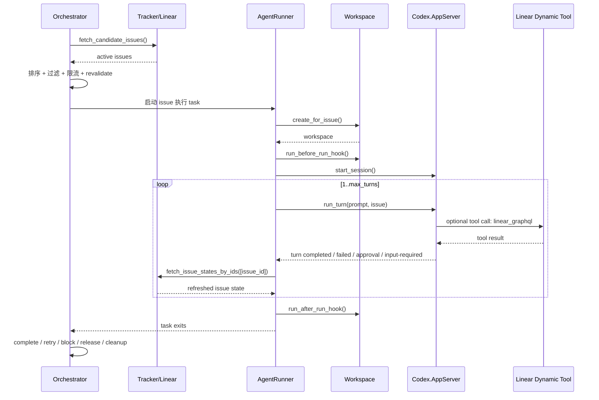

# Linear Issue 处理链路深度技术说明

本文档聚焦 **Symphony Elixir 如何处理一个 Linear issue**。目标不是介绍整个系统，而是从源码视角把一条 issue 的完整生命周期讲清楚：它如何被发现、筛选、调度、绑定工作区、驱动 Codex、多轮 turn、进入 retry/block/terminal 分支，以及最后如何回收状态和清理工作区。

相关主文件：

- `lib/symphony_elixir/orchestrator.ex`
- `lib/symphony_elixir/linear/client.ex`
- `lib/symphony_elixir/linear/adapter.ex`
- `lib/symphony_elixir/agent_runner.ex`
- `lib/symphony_elixir/workspace.ex`
- `lib/symphony_elixir/prompt_builder.ex`
- `lib/symphony_elixir/codex/app_server.ex`
- `lib/symphony_elixir/codex/dynamic_tool.ex`

---

## 1. 一条 issue 生命周期的总览

先看高层流程：

如果把它压缩成一句话：

> `Orchestrator` 负责决定“这条 issue 现在该不该跑”，`AgentRunner` 负责把它“真正跑起来”，`Codex.AppServer` 负责“与 Codex 协议交互”，`Workspace` 负责“把执行限制在一个安全隔离目录中”。

---

## 2. 入口：issue 是如何被发现的

### 2.1 轮询触发

`SymphonyElixir.Orchestrator` 是一个 `GenServer`。启动时会从 `Config.settings!()` 读取：

- `polling.interval_ms`
- `agent.max_concurrent_agents`

然后通过 `schedule_tick/2` 安排下一次 poll，见：

- `lib/symphony_elixir/orchestrator.ex:52`
- `lib/symphony_elixir/orchestrator.ex:67`
- `lib/symphony_elixir/orchestrator.ex:1512`

当 tick 到达：

1. `handle_info({:tick, tick_token}, state)` 把状态切到 `poll_check_in_progress`
2. 再异步发送 `:run_poll_cycle`
3. `handle_info(:run_poll_cycle, state)` 调用 `maybe_dispatch/1`

关键位置：

- `lib/symphony_elixir/orchestrator.ex:74`
- `lib/symphony_elixir/orchestrator.ex:109`
- `lib/symphony_elixir/orchestrator.ex:245`

### 2.2 从 Linear 拉取候选 issue

`maybe_dispatch/1` 里会调用：

- `Tracker.fetch_candidate_issues/0`

而 `Tracker` 只是抽象边界，默认实际走：

- `SymphonyElixir.Linear.Adapter.fetch_candidate_issues/0`
- 最终进入 `SymphonyElixir.Linear.Client.fetch_candidate_issues/0`

关键位置：

- `lib/symphony_elixir/tracker.ex:13`
- `lib/symphony_elixir/linear/adapter.ex:39`
- `lib/symphony_elixir/linear/client.ex:105`

### 2.3 Linear 查询实际会带哪些过滤条件

`Linear.Client.fetch_candidate_issues/0` 会读取 `Config.settings!().tracker`，使用这些条件：

- `project_slug`
- `active_states`
- `assignee`（可选）

GraphQL 查询里固定按：

- project slug
- state name in active states

做服务端过滤，见：

- `lib/symphony_elixir/linear/client.ex:11`
- `lib/symphony_elixir/linear/client.ex:238`

如果配置了 `tracker.assignee`，还会再做一层 worker 归属过滤：

- `routing_assignee_filter/0`
- `build_assignee_filter/1`
- `assigned_to_worker?/2`

关键位置：

- `lib/symphony_elixir/linear/client.ex:490`
- `lib/symphony_elixir/linear/client.ex:500`
- `lib/symphony_elixir/linear/client.ex:474`

这里有个很关键的细节：

### 关键细节 1：worker 路由不是在 Orchestrator 才决定，而是在 issue 归一化时就被打上标记

每个 Linear issue 会被转换成 `SymphonyElixir.Linear.Issue` 结构体：

- `assigned_to_worker`
- `blocked_by`
- `labels`
- `created_at`
- `updated_at`

见：

- `lib/symphony_elixir/linear/issue.ex:5`
- `lib/symphony_elixir/linear/client.ex:448`

也就是说，调度器后续不是再重新理解 Linear 原始字段，而是消费一个已经“调度友好化”的 issue 结构。

---

## 3. issue 被选中前要经历哪些筛选

### 3.1 第一层：候选 issue 基础合法性

真正决定是否可调度的是 `should_dispatch_issue?/4`，见：

- `lib/symphony_elixir/orchestrator.ex:786`

它要求同时满足：

1. `candidate_issue?/3` 为 true
2. 不是被未完成 blocker 阻塞的 Todo issue
3. 不在 `claimed`
4. 不在 `running`
5. 不在 `blocked`
6. orchestrator 全局还有空槽
7. 当前 issue 的 state 分组还有空槽
8. worker 容量还有空槽

### 3.2 `candidate_issue?/3` 的条件

`candidate_issue?/3` 要求 issue 具备：

- `id`
- `identifier`
- `title`
- `state`
- `assigned_to_worker == true`
- state 在 active state 集合中
- state 不在 terminal state 集合中

见：

- `lib/symphony_elixir/orchestrator.ex:824`
- `lib/symphony_elixir/orchestrator.ex:842`

### 3.3 blocker 对 Todo issue 的特殊处理

`todo_issue_blocked_by_non_terminal?/2` 是一个很容易忽略的调度门槛：

- 只有 issue 处于 `Todo`
- 并且其 `blocked_by` 中存在任何 **非 terminal** blocker

才会阻止调度。

见：

- `lib/symphony_elixir/orchestrator.ex:848`

### 关键细节 2：只有 `Todo` issue 会因为 blocker 被拦住

当前实现并不是“任何 active issue 只要有 blocker 就不跑”，而是 **Todo + blocker 未终结** 才不允许进入执行。也就是说：

- `In Progress` issue 即使还有 blocker 信息，也不一定被这里拦下
- 这是一个明显偏业务策略的选择，不是通用依赖图执行器

### 3.4 排序规则

候选 issue 先经过 `sort_issues_for_dispatch/1` 排序：

排序键是：

1. `priority_rank(issue.priority)`，1 到 4 越小越优先
2. `created_at` 越早越优先
3. `identifier/id` 作为稳定 tie-breaker

见：

- `lib/symphony_elixir/orchestrator.ex:766`

### 关键细节 3：这是“优先级优先 + FIFO”的调度，不是纯粹先来先服务

高优先级 issue 会抢在更老但低优先级 issue 之前被派发。

---

## 4. issue 为什么还要在 dispatch 前再校验一次

即使一条 issue 已通过 `should_dispatch_issue?/4`，`dispatch_issue/4` 也不会直接执行，而是先调用：

- `revalidate_issue_for_dispatch/3`

见：

- `lib/symphony_elixir/orchestrator.ex:893`
- `lib/symphony_elixir/orchestrator.ex:978`

它会再次调用：

- `Tracker.fetch_issue_states_by_ids([issue_id])`

然后根据最新 issue 状态决定：

- `{:ok, refreshed_issue}` → 真正调度
- `{:skip, refreshed_issue}` → 放弃本次调度
- `{:skip, :missing}` → issue 不可见/不活跃，放弃
- `{:error, reason}` → 记录 warning，放弃

### 关键细节 4：系统显式防止“陈旧快照调度”

`fetch_candidate_issues/0` 拉到的是一批候选 issue，但在高并发或外部状态变化场景下，它们可能已经过时。`revalidate_issue_for_dispatch/3` 就是为了在真正 spawn agent 前，再用单 issue 查询确认一遍。

这一步避免了两个问题：

- issue 刚好被改到 terminal/non-active 状态却仍被错误调度
- issue 的 blocker/assignee 等影响调度的属性刚好发生变化

---

## 5. issue 被派发时，Orchestrator 具体做了什么

### 5.1 worker 选择

`do_dispatch_issue/4` 里先选 worker：

- 没配 `worker.ssh_hosts` → 本地执行，返回 `nil`
- 配了多个 SSH host → 选择可用 host
- 若指定 preferred worker host 且还可用，优先复用
- 否则选最空闲 host

关键函数：

- `select_worker_host/2`
- `least_loaded_worker_host/2`
- `worker_host_slots_available?/2`

见：

- `lib/symphony_elixir/orchestrator.ex:1217`
- `lib/symphony_elixir/orchestrator.ex:1245`
- `lib/symphony_elixir/orchestrator.ex:1269`

### 关键细节 5：retry 会尽量回到原 worker host

重试逻辑里会把旧的 `worker_host` 带入 metadata，后续 `handle_active_retry/4` 再把这个 preferred host 传回 `dispatch_issue/4`。这意味着：

- 同一个 issue 的 continuation/retry 倾向在同一台 worker 上继续
- 有利于复用已存在的 workspace

### 5.2 spawn task

真正执行是在 `spawn_issue_on_worker_host/5`：

- `Task.Supervisor.start_child/2`
- 子任务执行 `AgentRunner.run(issue, recipient, attempt: attempt, worker_host: worker_host)`
- orchestrator 监控子任务 pid/ref

见：

- `lib/symphony_elixir/orchestrator.ex:926`

### 5.3 运行态记录

spawn 成功后，orchestrator 会在 `state.running[issue.id]` 中写入一份运行元数据：

- `pid`
- `ref`
- `identifier`
- `issue`
- `worker_host`
- `workspace_path`（初始 nil）
- `session_id`（初始 nil）
- `last_codex_*`
- `codex_*_tokens`
- `turn_count`
- `retry_attempt`
- `started_at`

并把 issue id 放进 `claimed`。

见：

- `lib/symphony_elixir/orchestrator.ex:935`

### 关键细节 6：`claimed` 比 `running` 更持久，它是去重锁

`running` 表示“当前有执行进程”，而 `claimed` 表示“调度器已经拥有这条 issue 的处理权”。

这能避免：

- 子任务刚结束但下一轮 poll 又把同一条 issue 抢出来重复派发
- retry / blocked / running 之间切换时的窗口抖动

---

## 6. 单 issue 执行器：AgentRunner 是怎么跑起来的

### 6.1 执行入口

`AgentRunner.run/3` 是单 issue 执行入口，见：

- `lib/symphony_elixir/agent_runner.ex:11`

它做的事非常克制：

1. 选定 worker host
2. 调用 `run_on_worker_host/4`
3. 如果失败，抛 `RuntimeError`

### 6.2 先建 workspace，再跑 hook，再开 Codex

`run_on_worker_host/4` 里顺序是：

1. `Workspace.create_for_issue(issue, worker_host)`
2. 向 orchestrator 回传 `worker_runtime_info`
3. `Workspace.run_before_run_hook/3`
4. `run_codex_turns/5`
5. `after` 里始终执行 `Workspace.run_after_run_hook/3`

见：

- `lib/symphony_elixir/agent_runner.ex:28`
- `lib/symphony_elixir/agent_runner.ex:31`
- `lib/symphony_elixir/agent_runner.ex:36`
- `lib/symphony_elixir/agent_runner.ex:40`

### 关键细节 7：`after_run` hook 无论 Codex 成功还是失败都会触发

这依赖 `try ... after` 结构，而 `Workspace.run_after_run_hook/3` 还会吞掉 hook failure，不让清理阶段反向污染主流程。

---

## 7. workspace 是如何创建和保护的

### 7.1 issue → workspace 目录名

`Workspace.create_for_issue/2` 先把 issue identifier 经过 `safe_identifier/1` 转成安全目录名：

- 只保留 `[a-zA-Z0-9._-]`
- 其它字符变成 `_`

见：

- `lib/symphony_elixir/workspace.ex:15`
- `lib/symphony_elixir/workspace.ex:205`

### 7.2 本地模式安全校验

本地 workspace 路径必须：

- 先 canonicalize
- 不能等于 workspace root
- 必须在 workspace root 之下
- 如果原始 expanded 路径看似在 root 下，但 canonical 后逃逸，认定为 symlink escape

见：

- `lib/symphony_elixir/workspace.ex:358`

### 关键细节 8：本地模式明确防止 symlink escape

这里的判断不是只做字符串前缀匹配，而是：

1. 先比较 canonical path
2. 再区分“真的在 root 下”与“路径文本看着在 root 下但其实经 symlink 跳出 root”

这是一个很重要的安全边界。

### 7.3 远端模式安全校验

远端模式不做 canonical 检查，而是做输入合法性约束：

- 不能为空
- 不能含换行、回车、NUL

见：

- `lib/symphony_elixir/workspace.ex:386`

### 7.4 workspace 是否会重复创建

本地模式 `ensure_workspace/2` 的逻辑：

- 已是目录 → 复用，`created? = false`
- 存在但不是目录 → `rm_rf!` 后重建
- 不存在 → 新建

远端模式类似，只是通过 shell script 执行。

见：

- `lib/symphony_elixir/workspace.ex:34`
- `lib/symphony_elixir/workspace.ex:48`

### 关键细节 9：`after_create` hook 只在首次创建时跑

`maybe_run_after_create_hook/4` 仅在 `created? == true` 时执行：

- continuation/retry 复用现有目录时不会重复 clone/bootstrap

见：

- `lib/symphony_elixir/workspace.ex:210`

这对性能和幂等都很关键。

---

## 8. prompt 是如何构建给 Codex 的

第一轮 turn 的 prompt 由 `PromptBuilder.build_prompt/2` 生成：

- 从 `Workflow.current()` 取得 prompt template
- 用 `Solid.render!` 渲染变量：
  - `issue`
  - `attempt`

见：

- `lib/symphony_elixir/prompt_builder.ex:9`
- `lib/symphony_elixir/prompt_builder.ex:17`

对于 issue，`PromptBuilder` 会把结构体递归转成适合 Solid 的 map/list/string/datetime 值。

### 关键细节 10：continuation turn 不会重放原 prompt，而是发送一个简短 continuation guidance

第二轮及以后 turn：

- 不再重新渲染完整 workflow prompt
- 而是发送一段 continuation 提示：恢复上下文、继续当前 issue、不要重复已完成工作

见：

- `lib/symphony_elixir/agent_runner.ex:133`
- `lib/symphony_elixir/agent_runner.ex:135`

这表示：

- 上下文连续性依赖 Codex thread 本身
- Symphony 不把每轮 turn 做成“无状态重放”模型

---

## 9. Codex session / thread / turn 是如何启动的

### 9.1 start_session

`Codex.AppServer.start_session/2` 的关键步骤：

1. `validate_workspace_cwd/2`
2. `start_port/2` 启动本地 bash/codex 或远端 SSH port
3. `session_policies/2` 读取 approval/sandbox 配置
4. `send_initialize/1`
5. `start_thread/3`

见：

- `lib/symphony_elixir/codex/app_server.ex:39`
- `lib/symphony_elixir/codex/app_server.ex:146`
- `lib/symphony_elixir/codex/app_server.ex:188`
- `lib/symphony_elixir/codex/app_server.ex:241`
- `lib/symphony_elixir/codex/app_server.ex:280`

### 9.2 thread/start

thread 启动时，Symphony 会发送：

- `approvalPolicy`
- `sandbox`
- `cwd`
- `dynamicTools`

其中动态工具由：

- `DynamicTool.tool_specs/0`

提供。

见：

- `lib/symphony_elixir/codex/app_server.ex:281`
- `lib/symphony_elixir/codex/dynamic_tool.ex:44`

### 9.3 turn/start

每次 turn 启动时，Symphony 发送：

- `threadId`
- `input`（文本 prompt）
- `cwd`
- `title`（`issue.identifier: issue.title`）
- `approvalPolicy`
- `sandboxPolicy`

见：

- `lib/symphony_elixir/codex/app_server.ex:304`

### 关键细节 11：thread sandbox 与 turn sandbox 是分开的

- thread 级别用 `thread_sandbox`
- turn 级别用 `turn_sandbox_policy`

这使 Symphony 可以在更细粒度上控制每轮执行的 cwd / 文件系统权限，而不是只在启动线程时一次性决定。

---

## 10. turn 执行中，Symphony 如何消费 Codex 消息流

### 10.1 基础收包循环

`await_turn_completion/4` 最终进入 `receive_loop/6`，持续接收 port 数据：

- `{:data, {:eol, chunk}}`
- `{:data, {:noeol, chunk}}`
- `{:exit_status, status}`
- timeout

见：

- `lib/symphony_elixir/codex/app_server.ex:329`
- `lib/symphony_elixir/codex/app_server.ex:340`

### 10.2 turn 的几种终结信号

`handle_incoming/6` 把 JSON 消息解析后重点识别：

- `turn/completed` → `{:ok, :turn_completed}`
- `turn/failed` → `{:error, {:turn_failed, params}}`
- `turn/cancelled` → `{:error, {:turn_cancelled, params}}`

见：

- `lib/symphony_elixir/codex/app_server.ex:367`

### 10.3 过程中间消息会不会被忽略

不会。所有中间消息都会通过 `emit_message/4` 回调发给 `AgentRunner` 提供的 `codex_message_handler/2`，再由 `AgentRunner` 发回 orchestrator：

- `{:codex_worker_update, issue_id, message}`

见：

- `lib/symphony_elixir/codex/app_server.ex:1009`
- `lib/symphony_elixir/agent_runner.ex:48`
- `lib/symphony_elixir/agent_runner.ex:54`

### 关键细节 12：Orchestrator 不直接读 port，而是消费 Codex 事件流的投影

这让 `Codex.AppServer` 和 `Orchestrator` 之间形成一个事件边界：

- AppServer 管协议
- Orchestrator 只管事件和状态累计

---

## 11. 动态工具是怎么被执行的

当前内置动态工具主要是：

- `linear_graphql`

定义见：

- `lib/symphony_elixir/codex/dynamic_tool.ex:7`
- `lib/symphony_elixir/codex/dynamic_tool.ex:44`

当 Codex 发送 `item/tool/call`：

1. `maybe_handle_approval_request/8` 识别到它
2. 提取 tool name 和 arguments
3. 调用 `tool_executor.(tool_name, arguments)`
4. 把结果通过 `send_message(port, %{"id" => id, "result" => result})` 回给 Codex

见：

- `lib/symphony_elixir/codex/app_server.ex:548`
- `lib/symphony_elixir/codex/app_server.ex:561`
- `lib/symphony_elixir/codex/app_server.ex:566`

`linear_graphql` 最终走 `Linear.Client.graphql/3`，使用 Symphony 自己的 Linear auth。

### 关键细节 13：工具执行发生在 Symphony 侧，不在 Codex sandbox 内

也就是说：

- Codex 发出工具调用请求
- 真正访问 Linear API 的是 Symphony 进程
- 工具能力和权限由 Symphony 控制，而不是把 token 直接交给 Codex shell

这是一条很重要的信任边界。

---

## 12. approval / input-required 是怎么处理的

### 12.1 自动 approval

如果 `approval_policy == "never"`，session 会带 `auto_approve_requests: true`。这时对以下请求会自动批准：

- `item/commandExecution/requestApproval`
- `execCommandApproval`
- `applyPatchApproval`
- `item/fileChange/requestApproval`

见：

- `lib/symphony_elixir/codex/app_server.ex:52`
- `lib/symphony_elixir/codex/app_server.ex:526`
- `lib/symphony_elixir/codex/app_server.ex:722`

### 12.2 tool request user input

对于 `item/tool/requestUserInput`：

- 若能识别出 approval 型问题，会自动选择 Approve 类选项
- 否则回一个固定的 non-interactive answer
- 如果连这个都构造不出来，就返回 `:input_required`

见：

- `lib/symphony_elixir/codex/app_server.ex:649`
- `lib/symphony_elixir/codex/app_server.ex:757`
- `lib/symphony_elixir/codex/app_server.ex:835`

### 12.3 明确需要人工输入的识别规则

`needs_input?/2` 会识别：

- `mcpServer/elicitation/request`
- 一系列 `turn/*input*` / `turn/approval_required` 方法
- payload 中 `requiresInput/needsInput/input_required/inputRequired` 等字段

见：

- `lib/symphony_elixir/codex/app_server.ex:1062`
- `lib/symphony_elixir/codex/app_server.ex:1071`

### 关键细节 14：一旦 turn 被识别为 input-required，Symphony 不会继续假装成功

这类情况会被上抛成：

- `{:error, {:turn_input_required, payload}}`
- 或 `{:error, {:approval_required, payload}}`

随后 orchestrator 会把 issue 进入 blocked 分支，而不是继续重试。

---

## 13. turn 结束后为什么还要重新查一次 issue 状态

每轮 `run_turn/4` 成功结束后，`AgentRunner.do_run_codex_turns/7` 会调用：

- `continue_with_issue?/2`

它再次请求：

- `Tracker.fetch_issue_states_by_ids([issue_id])`

如果 issue 仍处于 active state：

- 且 `turn_number < max_turns` → 同一 session 继续下一轮 turn
- 否则结束，把控制权还给 orchestrator

见：

- `lib/symphony_elixir/agent_runner.ex:103`
- `lib/symphony_elixir/agent_runner.ex:147`

### 关键细节 15：单次 agent run 是“多 turn 连续执行”，但有上限

`agent.max_turns` 不是全局 issue 生命周期上限，而是：

- **一次 AgentRunner 生命周期内** 最多连续执行多少轮 turn

超过这个数但 issue 仍 active：

- AgentRunner 正常返回
- Orchestrator 把它视为 continuation，1 秒后重试一次

这个 continuation retry 逻辑见：

- `lib/symphony_elixir/orchestrator.ex:199`
- `lib/symphony_elixir/orchestrator.ex:207`
- `lib/symphony_elixir/orchestrator.ex:1172`

---

## 14. Orchestrator 如何接收执行结果并维护状态

### 14.1 子任务退出

当 AgentRunner 子任务退出时，`Orchestrator.handle_info({:DOWN, ref, :process, _pid, reason}, state)` 会：

1. 根据 monitor ref 找到 issue_id
2. `pop_running_entry/2`
3. 记录 runtime totals
4. 根据退出原因调用：
   - `handle_agent_down(:normal, ...)`
   - 或 `handle_agent_down(reason, ...)`

见：

- `lib/symphony_elixir/orchestrator.ex:119`
- `lib/symphony_elixir/orchestrator.ex:1539`

### 14.2 正常结束并不等于 issue done

这是整个系统中最容易误读的地方：

`handle_agent_down(:normal, ...)` 默认不会直接 release issue，而是：

- 如果这是 input-required blocker → 进 blocked
- 否则 `complete_issue(issue_id)`
- 然后 `schedule_issue_retry(..., delay_type: :continuation)`

见：

- `lib/symphony_elixir/orchestrator.ex:199`

### 关键细节 16：正常退出只表示“本轮 agent run 结束”，不表示“issue 已经完成”

issue 是否完成，依赖的是下一次 retry 查询时它是否已经离开 active state，或者进入 terminal state；不是单靠 AgentRunner 返回 `:ok` 判断。

### 14.3 Codex 更新是怎么累计进 running 状态的

orchestrator 会处理：

- `{:worker_runtime_info, issue_id, runtime_info}`
- `{:codex_worker_update, issue_id, update}`

从而更新：

- `worker_host`
- `workspace_path`
- `session_id`
- `last_codex_event`
- `last_codex_message`
- `last_codex_timestamp`
- token 统计
- `turn_count`
- rate limits

见：

- `lib/symphony_elixir/orchestrator.ex:141`
- `lib/symphony_elixir/orchestrator.ex:158`
- `lib/symphony_elixir/orchestrator.ex:1438`

### 关键细节 17：token 统计不是简单覆盖，而是按“已上报总量差值”累加

`extract_token_delta/2` 会记录上次已上报的 input/output/total token，再从新 usage 中计算 delta。这样可以避免：

- 重复上报导致 double count
- 累积值倒退导致负数

见：

- `lib/symphony_elixir/orchestrator.ex:1619`

---

## 15. retry 是怎么运转的

### 15.1 哪些场景会进入 retry

1. spawn agent 失败
2. agent task 异常退出
3. turn 正常结束但 issue 仍 active（continuation）
4. stall timeout 且不是 input-required blocker
5. retry 时没有空闲 orchestrator/worker slot
6. retry poll 本身失败

### 15.2 retry 的核心数据结构

`state.retry_attempts[issue_id]` 会记录：

- `attempt`
- `timer_ref`
- `retry_token`
- `due_at_ms`
- `identifier`
- `error`
- `worker_host`
- `workspace_path`

见：

- `lib/symphony_elixir/orchestrator.ex:1006`

### 15.3 backoff 规则

- continuation 的第一次 retry：固定 1 秒
- failure retry：指数退避，base 10 秒，上限 `agent.max_retry_backoff_ms`

见：

- `lib/symphony_elixir/orchestrator.ex:1172`
- `lib/symphony_elixir/orchestrator.ex:1180`

### 15.4 retry 到点后会做什么

`handle_retry_issue/4`：

1. `Tracker.fetch_candidate_issues()`
2. 在候选列表中按 id 找回该 issue
3. 若 issue 已 terminal → 清理 workspace，release claim
4. 若 issue 仍可跑 → `handle_active_retry/4`
5. 若 issue 离开 active states → release claim
6. 若完全不可见 → release claim

见：

- `lib/symphony_elixir/orchestrator.ex:1062`
- `lib/symphony_elixir/orchestrator.ex:1082`
- `lib/symphony_elixir/orchestrator.ex:1142`

### 关键细节 18：retry 不是重新拿全量排序队列，而是“点对点继续追这条 issue”

这确保 continuation/failure retry 有更强的 issue 粘性，而不是重新和整个队列竞争排序。

---

## 16. blocked 是怎么运转的

### 16.1 进入 blocked 的路径

blocked 的核心来源是：

- turn 需要 operator input
- turn 需要 approval
- stalled，但最后一个事件就是 input-required / approval-required

这时 orchestrator 调用：

- `block_issue_from_entry/4`

见：

- `lib/symphony_elixir/orchestrator.ex:727`

blocked entry 保存：

- issue / identifier
- worker_host / workspace_path
- session_id
- error
- blocked_at
- last_codex_* 信息

### 16.2 blocked issue 之后还会被轮询吗

会。`reconcile_blocked_issues/1` 会周期性检查 blocked issue 当前状态：

- terminal → 清理 workspace 并 release block
- 不再路由给当前 worker → release block
- 仍 active → 仅刷新 issue state
- 非 active → release block

见：

- `lib/symphony_elixir/orchestrator.ex:325`
- `lib/symphony_elixir/orchestrator.ex:431`

### 关键细节 19：blocked 不是永久挂起，而是“仍被 orchestrator 追踪，但不自动重试执行”

也就是说：

- blocked issue 仍在 state 中可见
- 但不会再被当作普通 candidate 自动派发
- 只有外部状态变化后，才可能被 release 或 cleanup

---

## 17. stalled issue 是怎么检测和处理的

### 17.1 stall timeout 的定义

`reconcile_stalled_running_issues/1` 会检查 running issue 的最后活动时间：

- 优先 `last_codex_timestamp`
- 否则 `started_at`

超过 `codex.stall_timeout_ms` 就视为 stall。

见：

- `lib/symphony_elixir/orchestrator.ex:557`
- `lib/symphony_elixir/orchestrator.ex:616`

### 17.2 stall 后分两种处理

- 若最后状态说明需要输入/审批 → block
- 否则 → terminate + schedule retry(backoff)

见：

- `lib/symphony_elixir/orchestrator.ex:584`
- `lib/symphony_elixir/orchestrator.ex:591`

### 关键细节 20：stall 不是单纯“超时就失败”，而是会结合最后一条 Codex 事件判断语义

这避免把“等用户输入”的合法停顿误判成普通故障。

---

## 18. issue 状态变化时，运行中的任务会不会被强制停止

会。

每轮 poll，`maybe_dispatch/1` 之前会先做：

- `reconcile_running_issues/1`
- `reconcile_blocked_issues/1`

其中 `reconcile_running_issue_states/4` 会对每个正在跑的 issue 决定：

- terminal → `terminate_running_issue(..., cleanup_workspace: true)`
- 不再路由到当前 worker → terminate，不清 workspace
- 仍 active → 更新 issue state
- 非 active → terminate，不清 workspace

见：

- `lib/symphony_elixir/orchestrator.ex:246`
- `lib/symphony_elixir/orchestrator.ex:299`
- `lib/symphony_elixir/orchestrator.ex:396`

### 关键细节 21：只有 terminal state 会触发 workspace cleanup

对于：

- non-active state
- assignee 改变，不再路由到当前 worker

系统会停止任务、释放 claim，但 **不一定删除 workspace**。

只有 terminal 才会走 `cleanup_issue_workspace/2`。

这反映了一个策略：

- terminal = 工作彻底结束，可清理目录
- 非 terminal = 也许还会被其它 worker/后续流程接手，不急于删

---

## 19. terminal issue 是怎么清理的

### 19.1 启动时清理一遍历史 terminal issue

Orchestrator 初始化时先执行：

- `run_terminal_workspace_cleanup/0`

它会拉取 tracker 的 terminal states，对每个 issue identifier 执行：

- `Workspace.remove_issue_workspaces(identifier)`

见：

- `lib/symphony_elixir/orchestrator.ex:67`
- `lib/symphony_elixir/orchestrator.ex:1121`

### 19.2 retry 命中 terminal state 时立即清理

`handle_retry_issue_lookup/5` 如果发现 issue 已 terminal：

- `cleanup_issue_workspace(issue.identifier, metadata[:worker_host])`
- `release_issue_claim(state, issue_id)`

见：

- `lib/symphony_elixir/orchestrator.ex:1085`

### 19.3 workspace 删除前的 hook

`Workspace.remove/2` 在本地和远端模式都会先尝试：

- `before_remove` hook

但 hook 失败会被忽略，不阻止目录删除主流程。

见：

- `lib/symphony_elixir/workspace.ex:228`
- `lib/symphony_elixir/workspace.ex:253`

---

## 20. 这个链路里最关键的几个状态概念

### 20.1 `running`

表示：

- 当前存在一个对应 issue 的活跃 AgentRunner task
- 会持续接收 Codex 流式更新

### 20.2 `claimed`

表示：

- orchestrator 持有这条 issue 的处理权
- 用于防止重复派发

### 20.3 `retry_attempts`

表示：

- 当前没有活跃执行，但系统计划稍后再次处理这条 issue

### 20.4 `blocked`

表示：

- 系统确认这条 issue 目前无法在无人值守模式下继续推进
- 原因通常是 approval / input / elicitation

### 20.5 `completed`

它并不是“issue 业务完成”的真值，而更像是：

- 某轮会话已结束
- runtime totals 已被结算

真正业务层面的完成仍依赖 issue 状态是否已离开 active 集合，尤其是 terminal state。

---

## 21. 关键源码索引

### Orchestrator

- poll 与调度主循环：`lib/symphony_elixir/orchestrator.ex:74`, `lib/symphony_elixir/orchestrator.ex:109`, `lib/symphony_elixir/orchestrator.ex:245`
- issue 选择与过滤：`lib/symphony_elixir/orchestrator.ex:751`, `lib/symphony_elixir/orchestrator.ex:786`, `lib/symphony_elixir/orchestrator.ex:824`
- dispatch 前 revalidate：`lib/symphony_elixir/orchestrator.ex:893`, `lib/symphony_elixir/orchestrator.ex:978`
- spawn issue task：`lib/symphony_elixir/orchestrator.ex:926`
- retry：`lib/symphony_elixir/orchestrator.ex:1006`, `lib/symphony_elixir/orchestrator.ex:1062`, `lib/symphony_elixir/orchestrator.ex:1142`
- blocked / stall：`lib/symphony_elixir/orchestrator.ex:557`, `lib/symphony_elixir/orchestrator.ex:634`, `lib/symphony_elixir/orchestrator.ex:727`
- running/block 状态 reconcile：`lib/symphony_elixir/orchestrator.ex:325`, `lib/symphony_elixir/orchestrator.ex:385`, `lib/symphony_elixir/orchestrator.ex:431`

### Linear

- 拉取 candidate issues：`lib/symphony_elixir/linear/client.ex:105`
- issue 归一化：`lib/symphony_elixir/linear/client.ex:448`
- assignee 路由过滤：`lib/symphony_elixir/linear/client.ex:490`, `lib/symphony_elixir/linear/client.ex:500`
- tracker 边界：`lib/symphony_elixir/tracker.ex:13`

### AgentRunner

- 单 issue 执行入口：`lib/symphony_elixir/agent_runner.ex:11`
- workspace + hooks + Codex 主链路：`lib/symphony_elixir/agent_runner.ex:28`
- 多 turn continuation：`lib/symphony_elixir/agent_runner.ex:92`, `lib/symphony_elixir/agent_runner.ex:147`

### Workspace

- create_for_issue：`lib/symphony_elixir/workspace.ex:15`
- path safety：`lib/symphony_elixir/workspace.ex:358`
- remote workspace prepare：`lib/symphony_elixir/workspace.ex:48`
- after_create / before_run / after_run / before_remove hooks：`lib/symphony_elixir/workspace.ex:166`, `lib/symphony_elixir/workspace.ex:181`, `lib/symphony_elixir/workspace.ex:210`, `lib/symphony_elixir/workspace.ex:228`

### Codex

- session/thread/turn 启动：`lib/symphony_elixir/codex/app_server.ex:39`, `lib/symphony_elixir/codex/app_server.ex:280`, `lib/symphony_elixir/codex/app_server.ex:304`
- turn 流消费：`lib/symphony_elixir/codex/app_server.ex:329`, `lib/symphony_elixir/codex/app_server.ex:364`
- approval/tool/user input 处理：`lib/symphony_elixir/codex/app_server.ex:526`, `lib/symphony_elixir/codex/app_server.ex:548`, `lib/symphony_elixir/codex/app_server.ex:757`
- input-required 识别：`lib/symphony_elixir/codex/app_server.ex:1062`
- dynamic tool 定义：`lib/symphony_elixir/codex/dynamic_tool.ex:7`, `lib/symphony_elixir/codex/dynamic_tool.ex:44`

---

## 22. 总结：这条链路的本质是什么

如果只保留最关键的理解，这条 issue 处理链路的本质是：

1. **Linear issue 被先归一化，再调度**，不是直接对原始 GraphQL 响应做业务判断。
2. **Orchestrator 是状态机，不是执行器**；它维护 claim、retry、blocked、running 等运行态。
3. **AgentRunner 是单 issue 生命周期执行器**；它掌控 workspace、hooks、prompt、turn continuation。
4. **Codex.AppServer 是协议桥接器**；它把 JSON-RPC 流投影成 orchestrator 能消费的事件。
5. **Workspace 是安全边界**；issue 必须在 root 下的隔离目录中运行。
6. **“一次 agent run 正常结束”不等于“issue 结束”**；真正的推进依赖 retry + issue 最新状态判断。
7. **blocked、retry、terminal cleanup 都是显式状态分支**，不是异常路径里的附带行为。

所以，这套设计不是“轮询一下然后起个子进程”那么简单，而是一个围绕 **issue 所有权、状态一致性、工作区隔离、无人值守容错** 设计出来的编排状态机。
